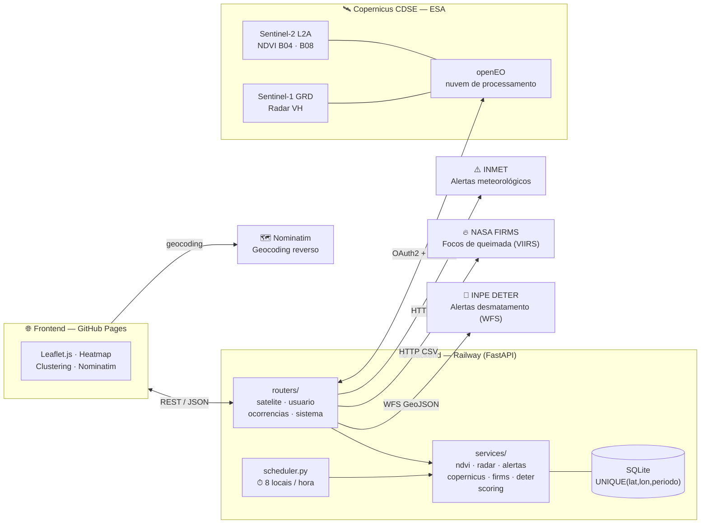
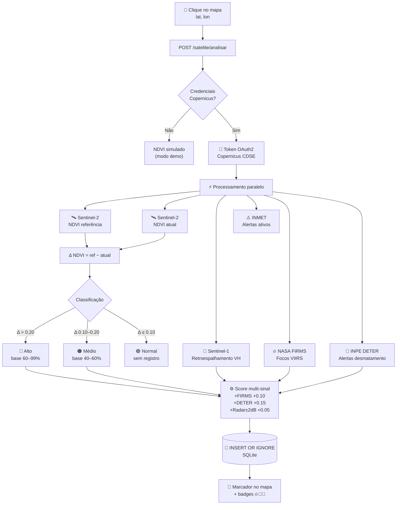
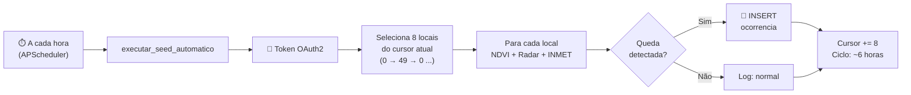

# ArvoreAlerta v2.0

Sistema de detecção e mapeamento de quedas de árvores utilizando imagens de satélite Sentinel-2 (Copernicus CDSE) e processamento de índice de vegetação NDVI.

**Stack:** FastAPI · SQLite · Leaflet.js · openEO · Copernicus CDSE (Sentinel-2 L2A · Sentinel-1 GRD) · APScheduler · INMET · NASA FIRMS · INPE DETER/TerraBrasilis

## Links úteis

| Recurso | URL |
|---|---|
| 🗺️ **Aplicação (frontend)** | https://sposigor.github.io/arvore-alerta/ |
| 📊 **Diagramas de arquitetura** | https://sposigor.github.io/arvore-alerta/diagrama.html |
| ⚙️ **API (Swagger / docs)** | https://arvore-alerta-production.up.railway.app/docs |
| 📈 **Estatísticas em tempo real** | https://arvore-alerta-production.up.railway.app/stats |
| ⏱️ **Status do scheduler** | https://arvore-alerta-production.up.railway.app/cron/status |
| 📥 **Export NDVI histórico (CSV)** | https://arvore-alerta-production.up.railway.app/satelite/ndvi-historico/exportar?formato=csv |
| 📥 **Export ocorrências (CSV)** | https://arvore-alerta-production.up.railway.app/ocorrencias/exportar?formato=csv |
| 📊 **Plot Bland-Altman (validação)** | [backend/scripts/bland_altman_delta.png](backend/scripts/bland_altman_delta.png) |

---

## Sobre o Projeto

ArvoreAlerta é um sistema web que detecta automaticamente possíveis quedas de árvores e eventos de desmatamento a partir da **fusão de múltiplas fontes de sensoriamento remoto**:

- **NDVI (Sentinel-2)** — índice ótico de vegetação
- **Radar (Sentinel-1)** — retroespalhamento VH independente de nuvens
- **Focos de queimada (NASA FIRMS)** — evidência correlacional de perda de cobertura
- **DETER/INPE** — polígonos oficiais de alerta de desmatamento (Amazônia + Cerrado)

O sistema compara o NDVI do período atual com o do mesmo período do ano anterior; quando detecta anomalia, reforça o nível de confiança com as evidências corroborantes (FIRMS, DETER, radar). Isso produz alertas com **múltiplas linhas de evidência**, mais defensáveis do que os baseados em NDVI isolado.

O projeto foi desenvolvido como Trabalho de Conclusão de Curso (TCC) e demonstra a viabilidade de usar APIs públicas e gratuitas (ESA Copernicus, NASA FIRMS, INPE TerraBrasilis) para monitoramento ambiental urbano e rastreamento de desmatamento.

---

## Arquitetura do Sistema

### Visão Geral dos Componentes



### Fluxo de Detecção de Queda



### Monitoramento Automático — Rotação de Locais



---

## Estrutura do Projeto

```
projeto_tcc/
├── backend/
│   ├── app/
│   │   ├── main.py              # FastAPI app + lifespan (ponto de entrada)
│   │   ├── config.py            # Variáveis de ambiente e constantes globais
│   │   ├── database.py          # init_db e get_db (SQLite)
│   │   ├── scheduler.py         # APScheduler — cron de monitoramento horário
│   │   ├── routers/
│   │   │   ├── satelite.py      # POST /satelite/analisar
│   │   │   ├── usuario.py       # /usuario/reportar · /usuario/reportes
│   │   │   ├── ocorrencias.py   # GET/DELETE /ocorrencias · /exportar
│   │   │   └── sistema.py       # GET /stats · /cron/status
│   │   └── services/
│   │       ├── copernicus.py    # OAuth2 CDSE + busca Sentinel-2
│   │       ├── ndvi.py          # NDVI via openEO (aceita data_fim histórica)
│   │       ├── radar.py         # Retroespalhamento VH — Sentinel-1 GRD
│   │       ├── alertas.py       # Alertas ativos — API INMET
│   │       ├── firms.py         # NASA FIRMS — focos de queimada (VIIRS)
│   │       ├── deter.py         # INPE DETER — alertas de desmatamento (WFS)
│   │       └── scoring.py       # Fusão multi-sinal da confiança
│   └── scripts/
│       ├── seed_real.py                     # Seed histórico trimestral (2 anos × 48 locais)
│       ├── exportar_locais_appeears.py      # Gera CSV no formato NASA AppEEARS
│       ├── importar_modis_appeears.py       # Ingere MODIS MOD13Q1 em SQLite local
│       ├── detectar_quedas_modis.py         # Aplica algoritmo do AA sobre série MODIS
│       ├── cruzar_delta_modis.py            # Comparação Δ-vs-Δ (validação principal)
│       └── plot_bland_altman.py             # Análise Bland-Altman (concordância)
├── frontend/
│   └── index.html               # Interface web (mapa + análise NDVI)
├── docs/
│   └── diagrama.html            # Diagrama interativo para apresentação
├── .github/
│   └── workflows/
│       ├── deploy-frontend.yml  # CI/CD → GitHub Pages
│       └── claude.yml           # Integração @claude em PRs/issues
├── requirements.txt             # Dependências Python
├── .env.example                 # Template de credenciais (versionar)
├── Dockerfile                   # Imagem Python 3.11-slim (Railway)
├── railway.toml                 # Configuração de deploy (Railway)
├── .gitignore
└── README.md
```

---

## Pré-requisitos

- **Python 3.9+**
- **Conta Copernicus CDSE** — gratuita, sem cartão de crédito
  - Cadastro: https://dataspace.copernicus.eu
  - Dá acesso a imagens Sentinel-2 dos últimos 2 anos e 15.000 créditos openEO/mês
- **Chave NASA FIRMS** (opcional, recomendada) — gratuita, sem cartão
  - Gere em: https://firms.modaps.eosdis.nasa.gov/api/map_key/
  - Habilita contagem de focos de queimada próximos ao ponto analisado

---

## Tutorial de Instalação

### 1. Clonar o repositório

```bash
git clone <url-do-repositorio>
cd projeto_tcc
```

### 2. Criar ambiente virtual Python

```bash
cd backend
python -m venv .venv

# Linux / macOS
source .venv/bin/activate

# Windows
.venv\Scripts\activate
```

### 3. Instalar dependências

```bash
pip install -r requirements.txt
```

### 4. Configurar credenciais Copernicus

```bash
# Na raiz do projeto
cp .env.example backend/.env
# Edite backend/.env com seu editor preferido e preencha suas credenciais
```

> Sem o `.env`, o sistema roda em **modo simulado** — todos os valores de NDVI são gerados aleatoriamente. Útil para testar a interface sem conta Copernicus.

### 5. Iniciar o backend

```bash
# Na pasta backend/
uvicorn app.main:app --reload --port 8000
```

API disponível em: http://localhost:8000  
Documentação interativa (Swagger): http://localhost:8000/docs

### 6. Iniciar o frontend

Em outro terminal:

```bash
cd frontend
python -m http.server 3000
```

Acesse: http://localhost:3000

### 7. Popular o banco de dados

**Apresentação rápida** (dados sintéticos, controlados via API):
```bash
# Defina SEED_TOKEN no .env (qualquer string)
curl -X POST "http://localhost:8000/admin/seed-fake?token=SEU_TOKEN&n=80&dias=180"

# Para limpar:
curl -X DELETE "http://localhost:8000/admin/seed-fake?token=SEU_TOKEN"
```

**Seed histórico real** (requer `.env` com CDSE configurado):
```bash
# Local — usa backend em http://localhost:8000
python backend/scripts/seed_real.py

# Produção — aponta para backend no Railway
API=https://arvore-alerta-production.up.railway.app python backend/scripts/seed_real.py
```

O script varre os **48 locais curados** (capitais + hotspots de desmatamento da Amazônia, Cerrado, Mata Atlântica) em **amostragem trimestral dos últimos 2 anos** (48 × 8 = 384 análises). Cada análise consome ~2-3 créditos openEO e leva 60-180 s — o seed completo leva ~10-15 h e ~1000-1500 créditos (dentro da quota gratuita).

Variáveis de ambiente suportadas:

| Env | Default | Descrição |
|-----|---------|-----------|
| `API` | `http://localhost:8000` | URL do backend |
| `ANOS` | `2` | Horizonte retroativo em anos |
| `DIAS_REF` | `30` | Janela de dias por snapshot NDVI |
| `MAX_LOCAIS` | `0` | Limita nº de locais (debug) |
| `PAUSA_S` | `20` | Pausa entre chamadas (s) — evita rate-limit CDSE |
| `CRON_ATIVO` | `true` | Liga/desliga o scheduler horário (`false` durante seeds longos) |

O UNIQUE index em `(lat, lon, periodo_atual)` garante idempotência — relançar o seed não duplica ocorrências.

---

## Como Usar

1. **Selecionar período** — seletor filtra ocorrências exibidas no mapa (15 dias até **2 anos**)
2. **Analisar um ponto** — clique em qualquer lugar do mapa para preencher coordenadas, ajuste a janela e clique em **Consultar Sentinel-2**
3. **Comparação de referência** — "mesmo período ano anterior" ou "período imediatamente anterior"
4. **Ver detalhes** — clique em marcador/card para abrir painel com NDVI, radar, alertas INMET e **evidências corroborantes** (FIRMS/DETER)
5. **Badges de evidência** — cada ocorrência exibe ícones 🔥 (foco de fogo próximo), 🌳 (alerta DETER) e 📡 (radar confirma) quando sinais adicionais reforçam o NDVI
6. **Filtrar por severidade** — botões **Todos / Alto / Médio** atualizam mapa e lista simultaneamente
7. **Exportar dados** — botões **⬇ GeoJSON** e **⬇ CSV** baixam ocorrências do período selecionado
8. **Expandir mapa** — botão `‹` na borda do painel recolhe a sidebar

---

## Como o NDVI funciona

O NDVI (Normalized Difference Vegetation Index) mede a densidade e saúde da vegetação a partir de imagens de satélite.

```
NDVI = (NIR - Red) / (NIR + Red)

  NIR = Banda B08 do Sentinel-2 (infravermelho próximo, 842 nm)
  Red = Banda B04 do Sentinel-2 (vermelho visível, 665 nm)
```

**Interpretação dos valores:**

| NDVI | Significado |
|------|-------------|
| > 0.5 | Vegetação densa e saudável |
| 0.2 – 0.5 | Vegetação moderada |
| 0.0 – 0.2 | Solo exposto ou vegetação esparsa |
| < 0.0 | Água, nuvens ou superfícies artificiais |

**Detecção de queda:**

O sistema compara o NDVI do período atual com o mesmo período do ano anterior. Uma queda brusca indica perda de cobertura vegetal.

| Δ NDVI | Nível | Confiança |
|--------|-------|-----------|
| > 0.20 | Alto | 60–99% |
| 0.10 – 0.20 | Médio | 40–60% |
| ≤ 0.10 | Normal | — |

**Análise complementar — Radar Sentinel-1:**

O Sentinel-1 usa radar SAR (Synthetic Aperture Radar) e penetra nuvens, coletando dados independente de condições climáticas. O sistema calcula a variação do retroespalhamento VH (vertical-horizontal) em dB:

| Δ VH (dB) | Interpretação |
|-----------|--------------|
| > 2 dB | Alteração significativa de cobertura |
| 1 – 2 dB | Alteração moderada |
| < 1 dB | Cobertura estável |

### Fusão multi-sinal da confiança

Uma vez que o NDVI detectou anomalia, o sistema consulta em paralelo **três fontes independentes** para corroborar — ou refutar — a hipótese de perda de cobertura:

| Fonte | API | Bônus | Justificativa |
|-------|-----|-------|---------------|
| NASA FIRMS (focos VIIRS) | `firms.modaps.eosdis.nasa.gov` | +0.10 | Fogo recente → queda NDVI é *consequência*, não artefato |
| INPE DETER (polígonos) | `terrabrasilis.dpi.inpe.br/geoserver/ows` | +0.15 | Ground-truth oficial do órgão brasileiro responsável |
| Radar Sentinel-1 (\|Δ\| > 2 dB) | openEO CDSE | +0.05 | Evidência estrutural independente de cobertura de nuvens |

A confiança final é truncada em `0.99` e fica disponível no campo `confianca` da resposta; `confianca_ndvi` preserva o valor original para comparação, e `fontes_corroborantes` lista textualmente as evidências somadas. Isso produz alertas com **múltiplas linhas de evidência** — mais defensáveis na banca e menos sujeitos a falsos positivos de nebulosidade, sazonalidade agrícola ou artefatos atmosféricos.

---

## API REST

### Por que uma API?

A API é a camada central do sistema. Ela orquestra três responsabilidades distintas:

1. **Integração com o Copernicus CDSE** — autentica via OAuth2, consulta o catálogo OData para encontrar cenas Sentinel-2 recentes com cobertura de nuvens < 20%, e processa as bandas via openEO
2. **Cálculo e persistência** — interpreta o NDVI calculado, classifica o nível de alerta e persiste ocorrências no banco SQLite
3. **Servir dados ao frontend** — expõe endpoints REST consumidos pelo mapa Leaflet em tempo real

Separar a API do frontend permite que qualquer outra interface (app mobile, painel municipal, script de automação) consuma os mesmos dados sem duplicar a lógica de negócio.

### Endpoints

#### Análise por Satélite

| Método | Rota | Descrição |
|--------|------|-----------|
| `POST` | `/satelite/analisar` | Consulta Sentinel-2 + Sentinel-1, calcula NDVI e registra se anomalia |

**Parâmetros (query string):**

| Parâmetro | Tipo | Padrão | Descrição |
|-----------|------|--------|-----------|
| `latitude` | float | — | Latitude do ponto |
| `longitude` | float | — | Longitude do ponto |
| `cidade` | string | null | Nome da cidade/bairro |
| `dias_ref` | int | 30 | Janela de referência NDVI em dias |
| `modo_ref` | string | `ano_anterior` | `ano_anterior` ou `recente` |
| `data_fim` | date | hoje | Data final da janela (YYYY-MM-DD) — para varredura histórica |

**Exemplo de resposta:**
```json
{
  "produto_sentinel2": "S2B_MSIL2A_20260418...",
  "ndvi_ref": 0.631,
  "ndvi_atual": 0.312,
  "ndvi_delta": 0.319,
  "periodo_atual": "20/03/2026 – 19/04/2026",
  "periodo_ref": "20/03/2025 – 19/04/2025",
  "modo_ref": "ano_anterior",
  "data_fim": "2026-04-19",
  "nivel": "alto",
  "queda_detectada": true,
  "confianca": 0.99,
  "confianca_ndvi": 0.88,
  "fontes_corroborantes": ["FIRMS (7 focos)", "DETER/INPE (2 alertas)", "Radar S1 (Δ=+3.5 dB)"],
  "descricao": "Queda brusca de NDVI detectada (Δ=0.319). Corroborado por: FIRMS (7 focos), DETER/INPE (2 alertas), Radar S1 (Δ=+3.5 dB).",
  "radar": { "vh_ref": 0.000412, "vh_atual": 0.000185, "vh_delta_db": 3.47 },
  "alertas_dc": "[Laranja] Chuvas intensas previstas para os próximos 2 dias",
  "focos_fogo": 7,
  "deter_alertas": 2,
  "ocorrencia_id": 42
}
```

#### Ocorrências

| Método | Rota | Parâmetros | Descrição |
|--------|------|------------|-----------|
| `GET` | `/ocorrencias` | `?dias=30&limite=100` | Lista ocorrências filtradas por período |
| `GET` | `/ocorrencias/exportar` | `?formato=geojson\|csv&dias=30` | Exporta em GeoJSON ou CSV |
| `DELETE` | `/ocorrencias/{id}` | — | Remove uma ocorrência |
| `GET` | `/satelite/ndvi-historico/exportar` | `?formato=csv\|json` | Exporta toda série NDVI real (incluindo "normais") |
| `GET` | `/satelite/ndvi-historico/stats` | — | Total / quedas / contagem por cidade |

#### Administração (apresentação)

Endpoints protegidos por env var `SEED_TOKEN` para popular o mapa rapidamente em demonstrações sem consumir quota Copernicus:

| Método | Rota | Parâmetros | Descrição |
|--------|------|------------|-----------|
| `POST` | `/admin/seed-fake` | `?token=X&n=80&dias=180` | Gera N ocorrências simuladas plausíveis (NDVI, FIRMS, DETER, radar) com `origem='seed_fake'` |
| `DELETE` | `/admin/seed-fake` | `?token=X` | Remove todas as ocorrências fake (rollback completo) |

#### Estatísticas e Monitoramento

| Método | Rota | Descrição |
|--------|------|-----------|
| `GET` | `/stats` | Total de ocorrências, confirmados e confiança média |
| `GET` | `/cron/status` | Status do scheduler automático, cursor e estimativa de créditos |

**Exemplo `/cron/status`:**
```json
{
  "ativo": true,
  "locais_total": 50,
  "lote_por_hora": 8,
  "cursor_atual": 16,
  "ciclo_completo_h": 7,
  "creditos_mes_est": 11520,
  "jobs": [{ "id": "seed_automatico", "proxima_exec": "2026-04-19 21:00:00-03:00" }],
  "modo_openeo": true
}
```

---

## Monitoramento Automático

O backend inclui um scheduler (APScheduler) que inicia automaticamente com o servidor e processa locais em rotação contínua sem intervenção manual.

**48 locais monitorados** (capitais + hotspots de desmatamento Amazônia/Cerrado + Mata Atlântica), processados em rotação contínua de 8 locais/hora — ciclo completo a cada ~6 horas.

**Orçamento de créditos openEO:**

| Recurso | Valor |
|---------|-------|
| Free tier Copernicus | 15.000 créditos/mês |
| Custo por análise NDVI | ~2 créditos |
| Lote por hora | 8 locais |
| Consumo estimado | ~11.520 créditos/mês |
| Margem de segurança | ~23% |

---

## Modos de Operação

| Modo | Configuração | NDVI | Scheduler | Uso |
|------|-------------|------|-----------|-----|
| **Simulado (sem credenciais)** | Sem `.env` | Aleatório no endpoint `/satelite/analisar` | Inativo | Testes locais sem conta Copernicus |
| **Real** | Com `.env` + openEO | Sentinel-2 real (openEO) | Ativo | Produção, TCC com dados reais |
| **Apresentação (seed fake)** | `SEED_TOKEN` definido | Real + ocorrências sintéticas via `/admin/seed-fake` | — | Demo com mapa cheio sem consumir Copernicus |

O sistema detecta automaticamente qual modo usar para `/satelite/analisar`. Se as credenciais estiverem configuradas e o pacote `openeo` instalado, usa dados reais com fallback automático para simulação em caso de erro (ex: nuvens, sem imagens no período).

---

## Custos da API Copernicus

| Recurso | Limite gratuito |
|---------|----------------|
| Busca no catálogo (OData/STAC) | Ilimitado |
| Download de bandas via S3 | 12 TB/mês |
| Processamento openEO | 15.000 créditos/mês |

**Para este projeto:** o consumo típico é de ~2 créditos openEO por análise NDVI. O scheduler automático consome ~11.500 créditos/mês — dentro do free tier com margem de segurança.

---

## Solução de Problemas

**Backend não conecta ao Copernicus:**
```
Verifique se CDSE_USER e CDSE_PASS estão corretos no .env
Teste a autenticação:
  python -c "from dotenv import load_dotenv; load_dotenv(); import os, httpx
  r = httpx.post('https://identity.dataspace.copernicus.eu/auth/realms/CDSE/protocol/openid-connect/token',
  data={'grant_type':'password','client_id':'cdse-public',
  'username':os.getenv('CDSE_USER'),'password':os.getenv('CDSE_PASS')}); print(r.status_code)"
```

**NDVI retorna simulado mesmo com credenciais:**
```
Verifique se openeo e numpy estão instalados: pip install openeo numpy
A resposta da API inclui o motivo no campo "produto_sentinel2"
Confirme o scheduler em: GET /cron/status
```

**Frontend não conecta ao backend:**
```
Confirme que o backend está rodando em http://localhost:8000
Verifique erros no console do navegador (F12)
```

**Nenhuma imagem Sentinel-2 encontrada:**
```
A região pode ter cobertura de nuvens > 20% no período
Aumente a janela de referência NDVI para 60 ou 90 dias
Regiões de alta nebulosidade (ex: Amazônia na estação chuvosa) podem não ter dados
Use modo_ref=recente para comparar com período mais próximo
```

---

## Deploy em Produção

### Arquitetura recomendada (gratuita / barata)

```
GitHub (código-fonte)
  ├── GitHub Pages  → frontend (index.html)     — grátis
  ├── Railway       → backend (FastAPI + cron)  — ~$5/mês
  └── GitHub Actions → CI/CD + @claude          — grátis
```

### 1. Backend — Railway

[railway.app](https://railway.app) — build via **Dockerfile** (Python 3.11-slim), volumes persistentes para o SQLite e deploy automático via GitHub.

```bash
# Instale o CLI do Railway
npm i -g @railway/cli

# Login e novo projeto
railway login
railway init

# Configure as variáveis de ambiente no painel Railway:
#   CDSE_USER       → seu email Copernicus
#   CDSE_PASS       → sua senha Copernicus
#   FIRMS_MAP_KEY   → chave NASA FIRMS (opcional, habilita focos de fogo)
#   DB_PATH         → /data/arvore_alerta.db  (aponta pro volume)

# Deploy
railway up
```

**Configurações obrigatórias no painel Railway:**

1. **Builder = Dockerfile** — em _Settings → Build_, defina `DOCKERFILE`. O `railway.toml` já aponta para `Dockerfile` na raiz.
2. **Volume persistente** — em _Volumes → New Volume_, mount em `/data` (1 GB basta). Sem isso o SQLite é apagado a cada deploy.
3. **Healthcheck** — em _Deploy → Healthcheck Path_ = `/stats`, timeout 60 s.
4. **Domínio público** — em _Settings → Networking → Generate Domain_ para expor a API publicamente.

O cron de monitoramento horário **inicia automaticamente** junto com o backend quando `CDSE_USER` e `CDSE_PASS` estão configurados. Monitore em: `GET /cron/status`.

### 2. Frontend — GitHub Pages

O deploy do frontend é automático via GitHub Actions a cada push em `main`.

**Configuração (uma vez só):**

1. No repositório GitHub → **Settings → Pages → Source**: `GitHub Actions`
2. Em **Settings → Secrets and variables → Actions → Variables**, adicione:
   - `BACKEND_URL` = URL do seu backend Railway (ex: `https://arvore-alerta.up.railway.app`)

A cada push, o workflow injeta a URL correta e publica o `frontend/index.html` automaticamente.

### 3. Claude Code — Integração GitHub

O workflow `.github/workflows/claude.yml` permite mencionar `@claude` em qualquer issue ou PR para obter análise de código, revisão e sugestões.

**Configuração:**
1. Em **Settings → Secrets → Actions**, adicione `ANTHROPIC_API_KEY` com sua chave da API Anthropic
2. Mencione `@claude` em qualquer comentário de PR ou issue

### Monitoramento automático em produção

Com o deploy ativo, o backend processa **8 locais/hora** em rotação contínua:
- Cobertura completa dos 48 locais a cada ~6 horas
- Estimativa de consumo: ~11.500 créditos openEO/mês (dentro do limite gratuito de 15.000)
- Endpoint de status: `GET /cron/status`

---

## Validação Científica — MODIS (NASA AppEEARS)

A metodologia do ArvoreAlerta foi validada contra o produto oficial **MODIS MOD13Q1.061** (Terra Vegetation Indices, 250 m, composição de 16 dias) extraído via [NASA AppEEARS](https://appeears.earthdatacloud.nasa.gov) para os mesmos 48 locais monitorados, cobrindo **dez/2019 a abr/2026** (~6,4 anos).

### Pipeline de validação

```
AppEEARS (Point Sample)        →   tcc-univesp-250426-MOD13Q1-061-results.csv  (7.008 linhas)
importar_modis_appeears.py     →   modis_local.db  (4.914 amostras com reliability ≤ 1)
detectar_quedas_modis.py       →   quedas_modis.csv  (4.076 eventos · 404 quedas detectadas)
cruzar_delta_modis.py          →   comparacao_delta_aa_vs_modis.csv  (Δ-vs-Δ)
plot_bland_altman.py           →   bland_altman_delta.png
```

### Resultados — análise de concordância Bland-Altman (Δ NDVI)

Comparação entre Δ NDVI calculado pelo ArvoreAlerta (Sentinel-2 / openEO) e Δ NDVI calculado pelo mesmo algoritmo aplicado à série MODIS:

| Métrica | Valor |
|---|---|
| n (matches) | 43 |
| Viés (média da diferença) | **+0.012** (sem viés sistemático) |
| Desvio-padrão da diferença | 0.091 |
| Limites de concordância (95%) | [−0.167; +0.190] |
| Pontos dentro dos LoA | **90.7%** (esperado teórico: 95%) |

**Interpretação:** o viés praticamente nulo demonstra que o ArvoreAlerta **não super- nem subestima sistematicamente** o sinal de variação NDVI em relação ao produto oficial MODIS. A concordância de 90,7% dentro dos limites validam a metodologia do TCC segundo o critério estatístico clássico de Bland & Altman (1986) para comparação de métodos de medida.

### Hotspots de desmatamento detectados pelo MODIS

Aplicando o mesmo algoritmo do ArvoreAlerta (Δ ≥ 0,10) sobre toda a série MODIS de 6 anos, **404 quedas** foram detectadas em 46 dos 48 locais. As 7 cidades com maior número de quedas correspondem exatamente a hotspots clássicos do desmatamento brasileiro:

| Cidade | Quedas | Bioma |
|---|---|---|
| Altamira-PA | 26 | Amazônia (BR-163) |
| Novo Progresso-PA | 25 | Amazônia (arco do desmatamento) |
| Humaitá-AM | 24 | Amazônia |
| Barreiras-BA | 23 | Cerrado / MATOPIBA |
| Lucas do Rio Verde-MT | 22 | Cerrado |
| Juína-MT | 20 | Amazônia / Cerrado |
| São Félix do Xingu-PA | 17 | Amazônia (pecuária) |

### Reproduzindo a validação

```bash
cd backend

# 1. Gerar CSV de pontos no formato AppEEARS
python scripts/exportar_locais_appeears.py
# → scripts/locais_appeears.csv (48 pontos)

# 2. Submeter manualmente em https://appeears.earthdatacloud.nasa.gov
#    Extract → Point Sample → Upload locais_appeears.csv
#    Produto: MOD13Q1.061  |  Layers: NDVI + pixel_reliability
#    Date Range: cobertura desejada (mínimo 2 anos para gerar Δ)

# 3. Após receber o e-mail, baixar e importar
python scripts/importar_modis_appeears.py /caminho/results.csv

# 4. Detectar quedas + cruzar + plotar
python scripts/detectar_quedas_modis.py
python scripts/cruzar_delta_modis.py
python scripts/plot_bland_altman.py
```

---

## Roadmap

- [x] Cálculo de NDVI com dados reais via openEO
- [x] Heatmap de densidade de ocorrências
- [x] Filtro por período e severidade
- [x] Clustering de marcadores no mapa
- [x] Painel de detalhes por ocorrência
- [x] Exportação GeoJSON / CSV
- [x] Comparação ano a ano (mesmo período safra anterior)
- [x] Integração com API de alertas da Defesa Civil (INMET)
- [x] Análise com Radar Sentinel-1 (ignora cobertura de nuvens)
- [x] Monitoramento automático horário (48 locais, APScheduler)
- [x] Deploy Railway + GitHub Pages + GitHub Actions
- [x] Integração NASA FIRMS (focos de queimada VIIRS)
- [x] Integração INPE DETER (alertas oficiais de desmatamento)
- [x] Fusão multi-sinal da confiança (NDVI + FIRMS + DETER + radar)
- [x] Varredura histórica com amostragem trimestral (2 anos × 48 locais)
- [x] Deduplicação via UNIQUE index em (lat, lon, periodo_atual)
- [x] Persistência de toda série NDVI real em `ndvi_historico` (não só quedas)
- [x] Validação contra MODIS MOD13Q1 / NASA AppEEARS (Bland-Altman, viés +0.012)
- [ ] Notificações push por área de interesse
- [ ] App mobile (PWA)
