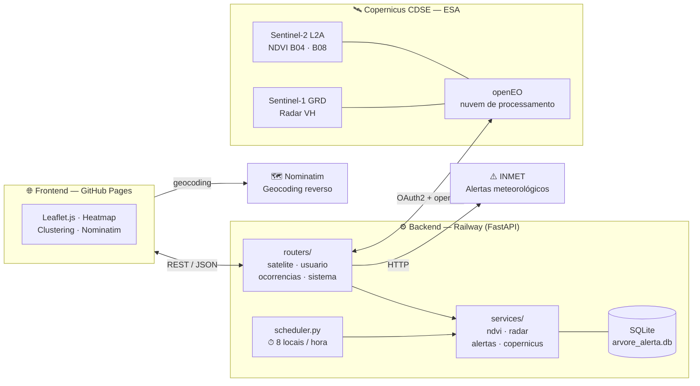
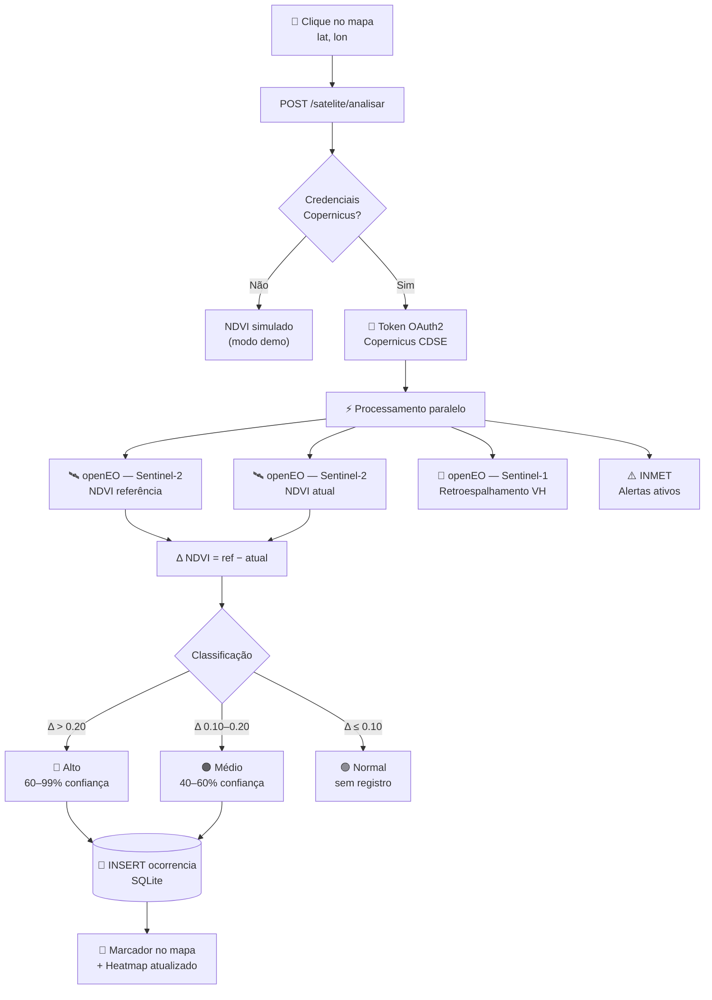
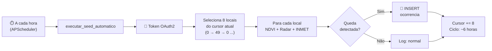

# ArvoreAlerta v2.0

Sistema de detecção e mapeamento de quedas de árvores utilizando imagens de satélite Sentinel-2 (Copernicus CDSE) e processamento de índice de vegetação NDVI.

**Stack:** FastAPI · SQLite · Leaflet.js · openEO · Copernicus CDSE (Sentinel-2 L2A · Sentinel-1 GRD) · APScheduler · INMET

---

## Sobre o Projeto

ArvoreAlerta é um sistema web que detecta automaticamente possíveis quedas de árvores a partir da análise de imagens de satélite. O sistema compara o índice de vegetação NDVI de um ponto geográfico em dois períodos distintos — se houver queda brusca, uma ocorrência é registrada com nível de confiança.

O projeto foi desenvolvido como Trabalho de Conclusão de Curso (TCC) e demonstra a viabilidade de usar dados públicos e gratuitos do programa Copernicus (ESA/União Europeia) para monitoramento ambiental urbano e rastreamento de desmatamento.

---

## Arquitetura do Sistema

### Visão Geral dos Componentes



### Fluxo de Detecção de Queda



### Monitoramento Automático — Rotação de Locais



---

## Estrutura do Projeto

```
projeto_tcc/
├── backend/
│   ├── app/
│   │   ├── main.py              # FastAPI app + lifespan (ponto de entrada)
│   │   ├── config.py            # Variáveis de ambiente e constantes globais
│   │   ├── database.py          # init_db e get_db (SQLite)
│   │   ├── scheduler.py         # APScheduler — cron de monitoramento horário
│   │   ├── routers/
│   │   │   ├── satelite.py      # POST /satelite/analisar
│   │   │   ├── usuario.py       # /usuario/reportar · /usuario/reportes
│   │   │   ├── ocorrencias.py   # GET/DELETE /ocorrencias · /exportar
│   │   │   └── sistema.py       # GET /stats · /cron/status
│   │   └── services/
│   │       ├── copernicus.py    # OAuth2 CDSE + busca Sentinel-2
│   │       ├── ndvi.py          # Cálculo NDVI via openEO + simulado
│   │       ├── radar.py         # Retroespalhamento VH — Sentinel-1 GRD
│   │       └── alertas.py       # Alertas ativos — API INMET
│   └── scripts/
│       ├── seed.py              # Popula banco com dados simulados (demo)
│       └── seed_real.py         # Popula banco com NDVI real via Copernicus
├── frontend/
│   └── index.html               # Interface web (mapa + análise NDVI)
├── docs/
│   └── diagrama.html            # Diagrama interativo para apresentação
├── .github/
│   └── workflows/
│       ├── deploy-frontend.yml  # CI/CD → GitHub Pages
│       └── claude.yml           # Integração @claude em PRs/issues
├── requirements.txt             # Dependências Python
├── .env.example                 # Template de credenciais (versionar)
├── nixpacks.toml                # Configuração de build (Railway/Nixpacks)
├── railway.toml                 # Configuração de deploy (Railway)
├── .gitignore
└── README.md
```

---

## Pré-requisitos

- **Python 3.9+**
- **Conta Copernicus CDSE** — gratuita, sem cartão de crédito
  - Cadastro: https://dataspace.copernicus.eu
  - Dá acesso a imagens Sentinel-2 dos últimos 2 anos e 15.000 créditos openEO/mês

---

## Tutorial de Instalação

### 1. Clonar o repositório

```bash
git clone <url-do-repositorio>
cd projeto_tcc
```

### 2. Criar ambiente virtual Python

```bash
cd backend
python -m venv .venv

# Linux / macOS
source .venv/bin/activate

# Windows
.venv\Scripts\activate
```

### 3. Instalar dependências

```bash
pip install -r requirements.txt
```

### 4. Configurar credenciais Copernicus

```bash
# Na raiz do projeto
cp .env.example backend/.env
# Edite backend/.env com seu editor preferido e preencha suas credenciais
```

> Sem o `.env`, o sistema roda em **modo simulado** — todos os valores de NDVI são gerados aleatoriamente. Útil para testar a interface sem conta Copernicus.

### 5. Iniciar o backend

```bash
# Na pasta backend/
uvicorn app.main:app --reload --port 8000
```

API disponível em: http://localhost:8000  
Documentação interativa (Swagger): http://localhost:8000/docs

### 6. Iniciar o frontend

Em outro terminal:

```bash
cd frontend
python -m http.server 3000
```

Acesse: http://localhost:3000

### 7. Popular o banco de dados

**Dados simulados** (rápido, sem conta Copernicus):
```bash
cd backend
python scripts/seed.py
```

**Dados reais via Copernicus** (requer `.env` configurado e backend rodando):
```bash
cd backend
python scripts/seed_real.py
# Processa ~29 cidades. Cada ponto leva 60–120 s.
```

---

## Como Usar

1. **Selecionar período** — o seletor no topo do painel filtra as ocorrências exibidas no mapa (15 dias até 1 ano)
2. **Analisar um ponto** — clique em qualquer lugar do mapa para preencher as coordenadas, ajuste a janela de referência NDVI e clique em **Consultar Sentinel-2**
3. **Comparação de referência** — escolha entre "mesmo período ano anterior" ou "período imediatamente anterior"
4. **Ver detalhes** — clique em qualquer marcador ou card da lista para abrir o painel de detalhes com NDVI, radar e alertas INMET
5. **Filtrar por severidade** — botões **Todos / Alto / Médio** acima da lista atualizam o mapa e a listagem simultaneamente
6. **Exportar dados** — botões **⬇ GeoJSON** e **⬇ CSV** baixam as ocorrências do período selecionado
7. **Expandir mapa** — o botão `‹` na borda do painel recolhe a sidebar

---

## Como o NDVI funciona

O NDVI (Normalized Difference Vegetation Index) mede a densidade e saúde da vegetação a partir de imagens de satélite.

```
NDVI = (NIR - Red) / (NIR + Red)

  NIR = Banda B08 do Sentinel-2 (infravermelho próximo, 842 nm)
  Red = Banda B04 do Sentinel-2 (vermelho visível, 665 nm)
```

**Interpretação dos valores:**

| NDVI | Significado |
|------|-------------|
| > 0.5 | Vegetação densa e saudável |
| 0.2 – 0.5 | Vegetação moderada |
| 0.0 – 0.2 | Solo exposto ou vegetação esparsa |
| < 0.0 | Água, nuvens ou superfícies artificiais |

**Detecção de queda:**

O sistema compara o NDVI do período atual com o mesmo período do ano anterior. Uma queda brusca indica perda de cobertura vegetal.

| Δ NDVI | Nível | Confiança |
|--------|-------|-----------|
| > 0.20 | Alto | 60–99% |
| 0.10 – 0.20 | Médio | 40–60% |
| ≤ 0.10 | Normal | — |

**Análise complementar — Radar Sentinel-1:**

O Sentinel-1 usa radar SAR (Synthetic Aperture Radar) e penetra nuvens, coletando dados independente de condições climáticas. O sistema calcula a variação do retroespalhamento VH (vertical-horizontal) em dB:

| Δ VH (dB) | Interpretação |
|-----------|--------------|
| > 2 dB | Alteração significativa de cobertura |
| 1 – 2 dB | Alteração moderada |
| < 1 dB | Cobertura estável |

---

## API REST

### Por que uma API?

A API é a camada central do sistema. Ela orquestra três responsabilidades distintas:

1. **Integração com o Copernicus CDSE** — autentica via OAuth2, consulta o catálogo OData para encontrar cenas Sentinel-2 recentes com cobertura de nuvens < 20%, e processa as bandas via openEO
2. **Cálculo e persistência** — interpreta o NDVI calculado, classifica o nível de alerta e persiste ocorrências no banco SQLite
3. **Servir dados ao frontend** — expõe endpoints REST consumidos pelo mapa Leaflet em tempo real

Separar a API do frontend permite que qualquer outra interface (app mobile, painel municipal, script de automação) consuma os mesmos dados sem duplicar a lógica de negócio.

### Endpoints

#### Análise por Satélite

| Método | Rota | Descrição |
|--------|------|-----------|
| `POST` | `/satelite/analisar` | Consulta Sentinel-2 + Sentinel-1, calcula NDVI e registra se anomalia |

**Parâmetros (query string):**

| Parâmetro | Tipo | Padrão | Descrição |
|-----------|------|--------|-----------|
| `latitude` | float | — | Latitude do ponto |
| `longitude` | float | — | Longitude do ponto |
| `cidade` | string | null | Nome da cidade/bairro |
| `dias_ref` | int | 30 | Janela de referência NDVI em dias |
| `modo_ref` | string | `ano_anterior` | `ano_anterior` ou `recente` |

**Exemplo de resposta:**
```json
{
  "produto_sentinel2": "S2B_MSIL2A_20260418...",
  "ndvi_ref": 0.631,
  "ndvi_atual": 0.312,
  "ndvi_delta": 0.319,
  "periodo_atual": "20/03/2026 – 19/04/2026",
  "periodo_ref": "20/03/2025 – 19/04/2025",
  "modo_ref": "ano_anterior",
  "nivel": "alto",
  "queda_detectada": true,
  "confianca": 0.88,
  "descricao": "Queda brusca de NDVI detectada (Δ=0.319). NDVI atual: 0.312.",
  "radar": { "vh_ref": 0.000412, "vh_atual": 0.000185, "vh_delta_db": 3.47 },
  "alertas_dc": "[Laranja] Chuvas intensas previstas para os próximos 2 dias",
  "ocorrencia_id": 42
}
```

#### Ocorrências

| Método | Rota | Parâmetros | Descrição |
|--------|------|------------|-----------|
| `GET` | `/ocorrencias` | `?dias=30&limite=100` | Lista ocorrências filtradas por período |
| `GET` | `/ocorrencias/exportar` | `?formato=geojson\|csv&dias=30` | Exporta em GeoJSON ou CSV |
| `DELETE` | `/ocorrencias/{id}` | — | Remove uma ocorrência |

#### Estatísticas e Monitoramento

| Método | Rota | Descrição |
|--------|------|-----------|
| `GET` | `/stats` | Total de ocorrências, confirmados e confiança média |
| `GET` | `/cron/status` | Status do scheduler automático, cursor e estimativa de créditos |

**Exemplo `/cron/status`:**
```json
{
  "ativo": true,
  "locais_total": 50,
  "lote_por_hora": 8,
  "cursor_atual": 16,
  "ciclo_completo_h": 7,
  "creditos_mes_est": 11520,
  "jobs": [{ "id": "seed_automatico", "proxima_exec": "2026-04-19 21:00:00-03:00" }],
  "modo_openeo": true
}
```

---

## Monitoramento Automático

O backend inclui um scheduler (APScheduler) que inicia automaticamente com o servidor e processa locais em rotação contínua sem intervenção manual.

**50 locais monitorados:**

| Categoria | Quantidade | Exemplos |
|-----------|-----------|---------|
| Capitais e metrópoles | 15 | São Paulo, Manaus, Belém, Brasília |
| Hotspots Amazônia (PRODES/INPE) | 22 | Altamira-PA, Colniza-MT, Ji-Paraná-RO, Lábrea-AM |
| Cerrado / Matopiba | 6 | Barreiras-BA, Araguaína-TO, Imperatriz-MA |
| Mata Atlântica | 4 | Santos-SP, Vitória-ES, Joinville-SC |
| Acre / Amazônia Sul | 3 | Cruzeiro do Sul, Lábrea, Humaitá |

**Orçamento de créditos openEO:**

| Recurso | Valor |
|---------|-------|
| Free tier Copernicus | 15.000 créditos/mês |
| Custo por análise NDVI | ~2 créditos |
| Lote por hora | 8 locais |
| Consumo estimado | ~11.520 créditos/mês |
| Margem de segurança | ~23% |

---

## Modos de Operação

| Modo | Configuração | NDVI | Scheduler | Uso |
|------|-------------|------|-----------|-----|
| **Simulado** | Sem `.env` | Aleatório | Inativo | Testes, demo de interface |
| **Real** | Com `.env` + openEO | Sentinel-2 real | Ativo | Produção, TCC com dados reais |

O sistema detecta automaticamente qual modo usar. Se as credenciais estiverem configuradas e o pacote `openeo` instalado, usa dados reais com fallback automático para simulação em caso de erro (ex: nuvens, sem imagens no período).

---

## Custos da API Copernicus

| Recurso | Limite gratuito |
|---------|----------------|
| Busca no catálogo (OData/STAC) | Ilimitado |
| Download de bandas via S3 | 12 TB/mês |
| Processamento openEO | 15.000 créditos/mês |

**Para este projeto:** o consumo típico é de ~2 créditos openEO por análise NDVI. O scheduler automático consome ~11.500 créditos/mês — dentro do free tier com margem de segurança.

---

## Solução de Problemas

**Backend não conecta ao Copernicus:**
```
Verifique se CDSE_USER e CDSE_PASS estão corretos no .env
Teste a autenticação:
  python -c "from dotenv import load_dotenv; load_dotenv(); import os, httpx
  r = httpx.post('https://identity.dataspace.copernicus.eu/auth/realms/CDSE/protocol/openid-connect/token',
  data={'grant_type':'password','client_id':'cdse-public',
  'username':os.getenv('CDSE_USER'),'password':os.getenv('CDSE_PASS')}); print(r.status_code)"
```

**NDVI retorna simulado mesmo com credenciais:**
```
Verifique se openeo e numpy estão instalados: pip install openeo numpy
A resposta da API inclui o motivo no campo "produto_sentinel2"
Confirme o scheduler em: GET /cron/status
```

**Frontend não conecta ao backend:**
```
Confirme que o backend está rodando em http://localhost:8000
Verifique erros no console do navegador (F12)
```

**Nenhuma imagem Sentinel-2 encontrada:**
```
A região pode ter cobertura de nuvens > 20% no período
Aumente a janela de referência NDVI para 60 ou 90 dias
Regiões de alta nebulosidade (ex: Amazônia na estação chuvosa) podem não ter dados
Use modo_ref=recente para comparar com período mais próximo
```

---

## Deploy em Produção

### Arquitetura recomendada (gratuita / barata)

```
GitHub (código-fonte)
  ├── GitHub Pages  → frontend (index.html)     — grátis
  ├── Railway       → backend (FastAPI + cron)  — ~$5/mês
  └── GitHub Actions → CI/CD + @claude          — grátis
```

### 1. Backend — Railway

[railway.app](https://railway.app) — suporta Python nativamente, volumes persistentes para o SQLite e deploy automático via GitHub.

```bash
# Instale o CLI do Railway
npm i -g @railway/cli

# Login e novo projeto
railway login
railway init

# Configure as variáveis de ambiente no painel Railway:
# CDSE_USER, CDSE_PASS, DB_PATH=/data/arvore_alerta.db

# Deploy
railway up
```

> **Volume SQLite:** no painel Railway, crie um volume em `/data` e defina `DB_PATH=/data/arvore_alerta.db` como variável de ambiente. Isso garante que o banco persista entre deploys.

O cron de monitoramento horário **inicia automaticamente** junto com o backend quando `CDSE_USER` e `CDSE_PASS` estão configurados. Monitore em: `GET /cron/status`.

### 2. Frontend — GitHub Pages

O deploy do frontend é automático via GitHub Actions a cada push em `main`.

**Configuração (uma vez só):**

1. No repositório GitHub → **Settings → Pages → Source**: `GitHub Actions`
2. Em **Settings → Secrets and variables → Actions → Variables**, adicione:
   - `BACKEND_URL` = URL do seu backend Railway (ex: `https://arvore-alerta.up.railway.app`)

A cada push, o workflow injeta a URL correta e publica o `frontend/index.html` automaticamente.

### 3. Claude Code — Integração GitHub

O workflow `.github/workflows/claude.yml` permite mencionar `@claude` em qualquer issue ou PR para obter análise de código, revisão e sugestões.

**Configuração:**
1. Em **Settings → Secrets → Actions**, adicione `ANTHROPIC_API_KEY` com sua chave da API Anthropic
2. Mencione `@claude` em qualquer comentário de PR ou issue

### Monitoramento automático em produção

Com o deploy ativo, o backend processa **8 locais/hora** em rotação contínua:
- Cobertura completa dos 50 locais a cada ~6 horas
- Estimativa de consumo: ~11.500 créditos openEO/mês (dentro do limite gratuito de 15.000)
- Endpoint de status: `GET /cron/status`

---

## Roadmap

- [x] Cálculo de NDVI com dados reais via openEO
- [x] Heatmap de densidade de ocorrências
- [x] Filtro por período e severidade
- [x] Clustering de marcadores no mapa
- [x] Painel de detalhes por ocorrência
- [x] Exportação GeoJSON / CSV
- [x] Comparação ano a ano (mesmo período safra anterior)
- [x] Integração com API de alertas da Defesa Civil (INMET)
- [x] Análise com Radar Sentinel-1 (ignora cobertura de nuvens)
- [x] Monitoramento automático horário (50 locais, APScheduler)
- [x] Deploy Railway + GitHub Pages + GitHub Actions
- [ ] Notificações push por área de interesse
- [ ] App mobile (PWA)
